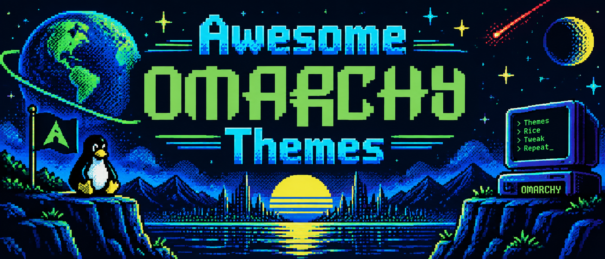

# Awesome Omarchy Themes



[](https://omarchy.org)
[](https://x.com/tonysimons_)
[](https://x.com/i/money/pay/tonysimons_)
[](https://github.com/AIowa-LLC/awesome-omarchy-themes/actions/workflows/validate.yml)
[](https://github.com/AIowa-LLC/awesome-omarchy-themes/releases/latest)
[](LICENSE)

A community collection of **12 themes for [Omarchy](https://omarchy.org)**, split evenly between dark and light modes. Omarchy is the batteries-included Hyprland desktop from Basecamp.

Each theme is a self-contained directory with a [`colors.toml`](https://github.com/omacom/omarchy/blob/quattro/docs/theming.md) palette and its own backgrounds, ready to install into `~/.config/omarchy/themes/` and apply with `omarchy theme set`.

## Installing a theme

Omarchy supports remote theme installation (`omarchy theme install <url>`). This collection nevertheless documents and recommends a plain copy of the individual theme directory because the repository enforces a stricter color-only safety policy and a copied theme directory is easy to inspect before applying.

```bash
git clone https://github.com/AIowa-LLC/awesome-omarchy-themes.git
cd awesome-omarchy-themes

# Copy the theme you want into your user themes directory
cp -r themes/<theme-name> ~/.config/omarchy/themes/

# Apply it
omarchy theme set <theme-name>
```

Revert to a stock theme at any time with `omarchy theme set <stock-theme-name>`.

## Themes

### Dark themes

| Theme | Mode | Identity |
| --- | --- | --- |
| [`hermes-bloodline`](themes/hermes-bloodline/) | dark | Deep black, bone white, arterial red - brutalist premium editorial. |
| [`hermtang`](themes/hermtang/) | dark | Black-plum, lavender, hot magenta - cyberpunk street culture. |
| [`nous-noir`](themes/nous-noir/) | dark | Ink black, graphite, bone white - museum-noir near-monochrome. |
| [`portal-vibes`](themes/portal-vibes/) | dark | Deep navy, electric cobalt, crisp white - Nous Portal dashboard. |
| [`green-magic`](themes/green-magic/) | dark | Forest black, luminous emerald, signal red - post-training foundry. |
| [`perfect-computer`](themes/perfect-computer/) | dark | Deep navy, Omarchy green, pale blue-white - the malleable agent OS. |

### Light themes

| Theme | Mode | Identity |
| --- | --- | --- |
| [`hermachy`](themes/hermachy/) | light | Porcelain, navy-charcoal, cobalt - architectural Omarchy branding. |
| [`nous-dayshift`](themes/nous-dayshift/) | light | Warm white, graphite, Nous cobalt - daylight community ops. |
| [`roseglass`](themes/roseglass/) | light | Pearl, wine ink, rose glass - soft power, hard systems. |
| [`codexy`](themes/codexy/) | light | Porcelain, deep ink, Codex blue - parallel agent build lab. |
| [`claudey`](themes/claudey/) | light | Warm ivory, deep ink, terracotta - computational research atelier. |
| [`tonarchy`](themes/tonarchy/) | light | Marble white, deep ink, signal red, gold - luxury Hermes chaos. |

Each theme lists its palette, contrast ratios, components, source artwork, and redistribution terms in its own README.

## Build Your Own Theme

This repo ships the same [Omarchy Theme Maker](skills/omarchy-theme-maker/) workflow that created the collection: palette extraction from source artwork, hand-tuning, WCAG contrast checks, real preview capture, and the validator-gated PR flow. Hand [`skills/omarchy-theme-maker/SKILL.md`](skills/omarchy-theme-maker/SKILL.md) to your coding agent, or follow it manually; see the skill's [README](skills/omarchy-theme-maker/README.md) for the friendly overview.

## What is in a theme?

A theme directory may contain:

| File | Purpose |
| --- | --- |
| `colors.toml` | **Required.** 26-key baseline palette, with supported current-Omarchy extensions allowed. Every shell surface, terminal, editor, and app theme generates from it. |
| `backgrounds/` | **Required.** At least one redistributable wallpaper, cycled with `omarchy theme bg next`. |
| `preview.png` | Recommended. Real applied-theme thumbnail for the switcher at exactly 1800x1012. |
| `icons.theme` | Optional. One verified stock icon-theme name, such as `Yaru-red`. |
| `README.md` | Recommended. Palette, contrast ratios, compatibility, credits, and image licensing. |

Palettes define `mode`, `accent`, `selection`, `muted`, a `background`/`foreground` ramp, and named colors (`red`, `green`, `blue`, etc.) plus bright variants. See the [official theming documentation](https://github.com/omacom/omarchy/blob/quattro/docs/theming.md) for the full key list and staging behavior.

Keep foreground/accent colors at >= 3:1 contrast against `background` so terminal and UI text stays readable.

## Compatibility and safety

- The collection targets the current Omarchy `colors.toml` theme model documented on the upstream `quattro` branch.
- Themes in this collection intentionally ship color/theme assets only. The repository rejects executable theme code, terminal-config overrides, and full `shell.toml` overrides even where upstream Omarchy may accept them.
- Every committed wallpaper must be redistributable and every theme README must state its source and redistribution terms.
- Tribute themes are unofficial community work. Third-party names, logos, and marks remain with their respective owners; no endorsement or affiliation is claimed.
- `scripts/validate.py` enforces palette structure, contrast floors, asset integrity, README index sync, and repository hygiene. CI runs the validator regression suite and the full repository validator on every PR.

## Validation

For contributors or anyone auditing the collection locally:

```bash
python3 -m pip install -r requirements-validator.txt
python3 -m unittest discover -s tests -v
python3 scripts/validate.py
```

A clean run is the repository's deterministic quality gate.

## Contributing

New themes and palette improvements are welcome. See [CONTRIBUTING.md](CONTRIBUTING.md) for contributor expectations, [docs/theme-creation.md](docs/theme-creation.md) for the full workflow, and [CODE_OF_CONDUCT.md](CODE_OF_CONDUCT.md) for community standards.

## Support and security

- Theme bugs and requests: [open an issue](https://github.com/AIowa-LLC/awesome-omarchy-themes/issues/new/choose).
- Suspected vulnerabilities: follow [SECURITY.md](SECURITY.md) and do not post sensitive details publicly.
- Bugs in Omarchy itself belong in the upstream [omacom/omarchy](https://github.com/omacom/omarchy) project.
- Release history: [CHANGELOG.md](CHANGELOG.md) and [GitHub Releases](https://github.com/AIowa-LLC/awesome-omarchy-themes/releases).

## License

Repository code and documentation are [MIT](LICENSE). Individual theme artwork is governed by the source/license statement in that theme's README.

Banner artwork (`assets/awesome-omarchy-themes.png`): original composition supplied by the repository owner; the Omarchy name and logos, the Arch Linux and Tux marks, and any other brand elements it depicts remain subject to their respective owners' rights. This is an unofficial community project with no endorsement or affiliation claimed.
