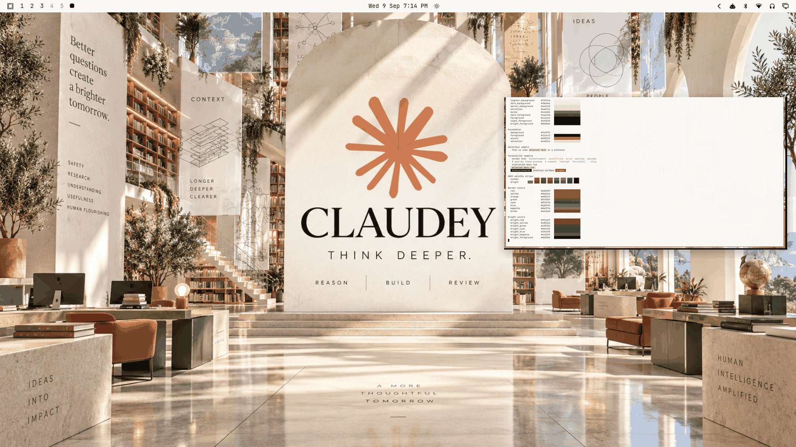

# Claudey



An unofficial **Claude / Anthropic** tribute theme — a monumental computational library rendered from the supplied CLAUDEY artwork: warm ivory limestone arches, a terracotta starburst over the great arch, olive groves in planters, dusty-blue coastal light through arched windows, deep-ink serif editorialism. **Think deeper.** Reason | build | review — research, context, agents, human judgment.

The theme translates the atelier into a warm light daily-driver: warm paper `#faf9f5` base with parchment support surfaces, nearly-black ink typography, a Claude-family terracotta operational accent, restrained olive and dusty blue in support, warm gray for muted states. It should read like a sunlit research atelier rather than a generic AI theme — scholarly, architectural, editorial, human-centered.

> **Not affiliated or endorsed.** This is an unofficial community tribute. Nothing here claims Anthropic's or Claude's endorsement, sponsorship, or official affiliation.

## Light-mode notes

A true light theme (`mode = "light"`), validated by the repo's relationship-based light-theme model: `background` is the lightest surface stop, `muted` sits between the surfaces and the primary foregrounds, and `foreground`/`bright_foreground` are darker than every surface. Following the collection's light-theme convention, normal ANSI colors are deepened saturations and bright variants are the darker tones — terminal syntax stays legible on warm paper.

**Accessibility-driven accent deviation:** the artwork's brighter terracotta (and Claude's `#d97757`) measures **2.96:1** on warm paper — below the validator's 3:1 floor and far below the collection's ≥ 4:1 daily-driver target. The operational accent is therefore a darker terracotta from the same hue family, `#b8552f` (**4.55:1**), which keeps the brand hue clearly recognizable while remaining readable as an active shell accent. Readability was not weakened for brand fidelity.

## Palette

| Role | Hex | Contrast vs background |
| --- | --- | --- |
| background (warm paper) | `#faf9f5` | — |
| lighter_background | `#f3f1ea` | — |
| dark_background | `#f0ede4` | — |
| darker_background (parchment) | `#e6e1d3` | — |
| selection (limestone tint) | `#eadfce` | — |
| muted (warm gray) | `#6e6a5e` | 5.13:1 |
| dark_foreground (inactive) | `#4a463d` | 8.92:1 |
| foreground (deep ink) | `#141413` | 17.50:1 |
| light_foreground | `#101010` | 18.06:1 |
| bright_foreground | `#0b0b0a` | 18.69:1 |
| accent (operational terracotta) | `#b8552f` | 4.55:1 |

| Role | Hex | Contrast vs background |
| --- | --- | --- |
| red | `#b8232f` | 6.00:1 |
| yellow | `#8a6a1e` | 4.79:1 |
| orange | `#a0521f` | 5.36:1 |
| green | `#55702f` | 5.32:1 |
| cyan | `#0f6e7a` | 5.64:1 |
| blue (dusty blue) | `#2d5f94` | 6.28:1 |
| magenta | `#8a3f7a` | 6.49:1 |
| brown | `#6e4a26` | 7.46:1 |

| Role | Hex | Contrast vs background |
| --- | --- | --- |
| bright_red | `#991d27` | 7.79:1 |
| bright_yellow | `#6d5316` | 6.88:1 |
| bright_green | `#425722` | 7.61:1 |
| bright_cyan | `#0a545e` | 8.16:1 |
| bright_blue | `#234a78` | 8.58:1 |
| bright_magenta | `#6e315f` | 8.79:1 |

Every ratio above was computed per color with standard WCAG relative luminance. Every normal and bright ANSI color holds **≥ 4.79:1** against `background` and **≥ 3.83:1** against the darkest surface (`selection`, `#eadfce`) — minima are yellow `#8a6a1e` in both cases, checked color-by-color. Selected text (`bright_foreground` vs `selection`) is 14.95:1.

## What ships

| File | Purpose |
| --- | --- |
| `colors.toml` | Full 26-key light palette — every shell surface, terminal, editor, and app theme generates from this. |
| `backgrounds/0-claudey.png` | Canonical wallpaper (1672×940), used as-is. |
| `icons.theme` | `Yaru-wartybrown` — the warm earth-family stock icon set shipped by Omarchy (same family as stock `gruvbox` / `retro-82` use via `Yaru-olive` / `Yaru-wartybrown`). |
| `preview.png` | Theme-switcher thumbnail (1800×1012). |

No `.lua`, terminal configs, or `vscode.json` are shipped, so nothing is filtered when the theme is staged from a git checkout — the palette expresses the entire theme.

## Install

From a clone of this repository:

```bash
cp -r themes/claudey ~/.config/omarchy/themes/
omarchy theme set claudey
```

## Compatibility

- Built and verified against Omarchy `4.0.3-1` (quattro-era theming: canonical `colors.toml` keys, light-mode surface relationships per stock light themes).
- No hand-written overrides over generated files; tracks template output cleanly across Omarchy updates.

## Credits, trademark, and license

- **Wallpaper** (`backgrounds/0-claudey.png`): original composition created for this collection and supplied by the repository owner (Tony Simons / AIowa LLC). The composition itself is dedicated to the public domain under [CC0 1.0](https://creativecommons.org/publicdomain/zero/1.0/) by its supplier — **but the Claude / Anthropic names, logos, marks, and brand elements contained within it are not CC0**: they remain subject to the copyright and trademark rights of their respective owners (Anthropic) and are used here for an unofficial community tribute only. No ownership of, or endorsement by, Anthropic is claimed.
- **Preview** (`preview.png`): a derivative work composed from live captures of the applied theme (wallpaper + shell surfaces + palette terminal). It embeds the same Claude / Anthropic brand marks and therefore carries the same caveat: the composition is CC0 by its supplier, while the third-party marks within it remain with their owners.
- **Palette**: hand-authored to the artwork's ivory/ink/terracotta identity with WCAG contrast verification.
