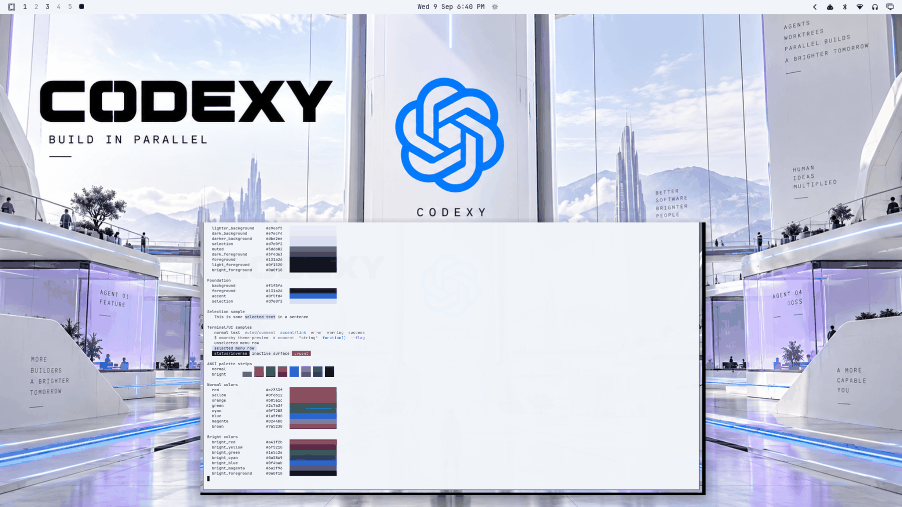

# Codexy



A tribute theme inspired by **OpenAI Codex** — built around the supplied CODEXY artwork: a bright, porcelain-white architectural build lab where a lone human faces a white monolith ringed by lavender agent pods, blue neon seams, and olive trees. **Build in parallel.** Plan / spawn / build / merge / repeat — agents in worktrees, parallel builds multiplying what one person can ship.

The theme translates that into a premium light daily-driver: cool porcelain surfaces, deep-ink typography, a strong Codex-blue accent, pale-mist and lavender supports, and restrained cyan technical highlights. It should read like Codex became a bright futuristic workstation environment — sharp, minimal, technical, never cozy and never dark.

> **Not affiliated or endorsed.** This is an unofficial community tribute. Nothing here claims OpenAI's or Codex's endorsement, sponsorship, or official affiliation.

## Light-mode notes

A true light theme (`mode = "light"`), validated by the repo's corrected light-theme model (luminance relationships, matching current Omarchy stock light themes): `background` is the lightest surface stop, `muted` sits between the surfaces and the primary foregrounds, and `foreground`/`bright_foreground` are darker than every surface. Following the collection's light-theme convention, normal ANSI colors are deepened saturations and bright variants are the darker tones — terminal syntax stays legible on porcelain.

The accent is the artwork's Codex blue deepened to `#0f5fd4` for strong on-porcelain readability (5.32:1). Blue leads the identity; lavender/magenta and cyan stay in disciplined support roles.

## Palette

| Role | Hex | Contrast vs background |
| --- | --- | --- |
| background (porcelain) | `#f1f5fa` | — |
| lighter_background | `#e9eef5` | — |
| dark_background | `#e7ecf4` | — |
| darker_background | `#dbe2ee` | — |
| selection (blue-tinted) | `#d7e0f2` | — |
| muted | `#5d6b82` | 4.93:1 |
| dark_foreground (inactive) | `#3f4d63` | 7.82:1 |
| foreground (deep ink) | `#131a26` | 15.94:1 |
| light_foreground | `#0f1520` | 16.70:1 |
| bright_foreground | `#0a0f18` | 17.53:1 |
| accent (Codex blue) | `#0f5fd4` | 5.32:1 |

| Role | Hex | Contrast vs background |
| --- | --- | --- |
| red | `#c2333f` | 5.00:1 |
| yellow | `#8f6b12` | 4.48:1 |
| orange | `#b05a1c` | 4.43:1 |
| green | `#2c7a3f` | 4.82:1 |
| cyan | `#0f7285` | 5.09:1 |
| blue | `#1a5fd0` | 5.34:1 |
| magenta | `#8244b8` | 5.53:1 |
| brown | `#7a5230` | 6.23:1 |

| Role | Hex | Contrast vs background |
| --- | --- | --- |
| bright_red | `#a41f2b` | 6.83:1 |
| bright_yellow | `#6f5210` | 6.64:1 |
| bright_green | `#1e5c2e` | 7.31:1 |
| bright_cyan | `#0a5869` | 7.34:1 |
| bright_blue | `#0f4bab` | 7.34:1 |
| bright_magenta | `#6a2f96` | 7.80:1 |

Every normal and bright ANSI color holds ≥ 4.43:1 against `background` and ≥ 3.66:1 even against the darkest surface (`selection`). Selected text (`bright_foreground` vs `selection`) is 14.47:1.

## What ships

| File | Purpose |
| --- | --- |
| `colors.toml` | Full 26-key light palette — every shell surface, terminal, editor, and app theme generates from this. |
| `backgrounds/0-codexy.png` | Canonical wallpaper (1672×941), used as-is. |
| `icons.theme` | `Yaru-blue` — the blue-family stock icon set shipped by Omarchy (same choice as stock `nord`, `kanagawa`, `rose-pine`, and this collection's `hermachy` / `portal-vibes`). |
| `preview.png` | Theme-switcher thumbnail (1800×1012). |

No `.lua`, terminal configs, or `vscode.json` are shipped, so nothing is filtered when the theme is staged from a git checkout — the palette expresses the entire theme.

## Install

From a clone of this repository:

```bash
cp -r themes/codexy ~/.config/omarchy/themes/
omarchy theme set codexy
```

## Compatibility

- Built and verified against Omarchy `4.0.3-1` (quattro-era theming: canonical `colors.toml` keys, light-mode surface relationships per stock light themes).
- No hand-written overrides over generated files; tracks template output cleanly across Omarchy updates.

## Credits, trademark, and license

- **Wallpaper** (`backgrounds/0-codexy.png`): original composition created for this collection and supplied by the repository owner (Tony Simons / AIowa LLC). The composition itself is dedicated to the public domain under [CC0 1.0](https://creativecommons.org/publicdomain/zero/1.0/) by its supplier — **but the Codex / OpenAI name, logos, and other brand marks contained within it are not CC0**: they remain subject to the copyright and trademark rights of their respective owners (OpenAI) and are used here for an unofficial community tribute only. No ownership of, or endorsement by, OpenAI is claimed.
- **Preview** (`preview.png`): a derivative work composed from live captures of the applied theme (wallpaper + shell surfaces + palette terminal). It embeds the same Codex / OpenAI brand marks and therefore carries the same caveat: the composition is CC0 by its supplier, while the third-party marks within it remain with their owners.
- **Palette**: hand-authored to the artwork's porcelain/ink/Codex-blue identity with WCAG contrast verification.
