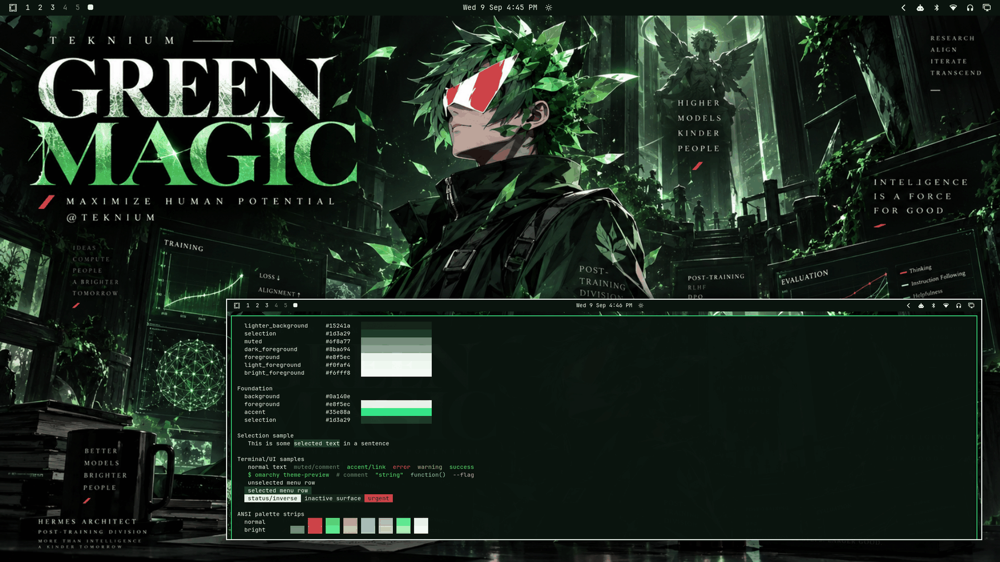

# Green Magic



A dark research-foundry tribute theme: near-black forest base, luminous emerald identity, pale mint-white text, and one scarce signal red. Built around the GREEN MAGIC artwork — a post-training wizard in a dark technical coat, bio-synthetic leaf hair, red-mirrored visor, cradling a glowing crystalline leaf in a cathedral hall reclaimed by green growth, surrounded by TRAINING loss curves, EVALUATION dashboards, and the POST-TRAINING DIVISION manifest. Dangerous but polished; editorial, not noisy.

**A tribute to Teknium.** Green Magic celebrates Teknium's role in the Hermes lineage and the broader Nous ecosystem — post-training and model development, research and alignment, and the *maximize human potential* ethos (hermes architect, post-training division). The hero is an original comic/editorial interpretation inspired by his supplied avatar language (green bio-synthetic hair, leaf/shard geometry, red-and-white visor, confident wizard-architect energy) — a stylized tribute character, not a literal portrait. This is an unofficial appreciation of publicly known work; no endorsement, commission, or official affiliation is claimed.

## Dark-mode notes

A true dark theme (`mode = "dark"`): the neutral ramp rises from near-black forest (`#040905`) through deep-green surfaces to pale mint-white foregrounds — dark foundry air, luminous text. The ANSI set is deliberately restrained: greens carry the family, the red stays the scarce signal (visor, urgent, errors), and supporting tones (gold, amber, teal, slate, lilac) are kept quiet so the black/emerald/red identity is never washed out by rainbow syntax.

## Palette

| Role | Hex | Contrast vs background |
| --- | --- | --- |
| background (forest black) | `#0a140e` | — |
| foreground (pale mint) | `#e8f5ec` | 16.71:1 |
| bright_foreground | `#f6fff8` | 18.38:1 |
| accent (luminous emerald) | `#35e88a` | 11.67:1 |
| muted (sage gray) | `#6f8a77` | 4.98:1 |
| selection (deep green) | `#1d3a29` | — |

The accent is the artwork's luminous emerald — the glow of the crystalline leaf — kept at full luminance (11.67:1). The red signal (`#f04553`, 5.08:1) is reserved for errors/urgent and the visor's mirror flash. All named and bright colors hold ≥ 5.08:1 against `background`; the surface ramp runs `#040905 → #15241a` with the deep-green selection between surfaces and foregrounds.

## What ships

| File | Purpose |
| --- | --- |
| `colors.toml` | Full 26-key dark palette — every shell surface, terminal, editor, and app theme generates from this. |
| `backgrounds/0-green-magic.png` | Canonical artwork (1672×941), owner-supplied, used as-is. |
| `icons.theme` | `Yaru-sage` — the green-matched supported stock icon set. |
| `preview.png` | Theme-switcher thumbnail (1800×1012), captured from a live themed session. |

No `.lua`, terminal configs, or `vscode.json` are shipped, so nothing is filtered when the theme is staged from a git checkout — the palette expresses the entire theme.

## Install

From a clone of this repository:

```bash
cp -r themes/green-magic ~/.config/omarchy/themes/
omarchy theme set green-magic
```

## Compatibility

- Built and verified against Omarchy `4.0.3-1` (quattro-era theming: canonical `colors.toml` keys, dark-mode ramp, generated surface files).
- No hand-written overrides over generated files; tracks template output cleanly across Omarchy updates.

## Credits & license

- **Wallpaper** (`backgrounds/0-green-magic.png`): created specifically for this collection and supplied by the repository owner (Tony Simons / AIowa LLC) as canonical theme artwork — an original editorial composition with an avatar-inspired tribute hero. Dedicated to the public domain under [CC0 1.0](https://creativecommons.org/publicdomain/zero/1.0/) — copy, modify, and redistribute freely, no attribution required. Unofficial tribute; no endorsement or commission implied. No third-party logos or unlicensed assets.
- **Preview** (`preview.png`): a derivative work composed from live captures of the applied theme (wallpaper + shell surfaces + palette terminal); same source artwork, same CC0 1.0 dedication.
- **Palette**: hand-authored to the artwork's forest-black/emerald/signal-red identity with WCAG contrast verification.
