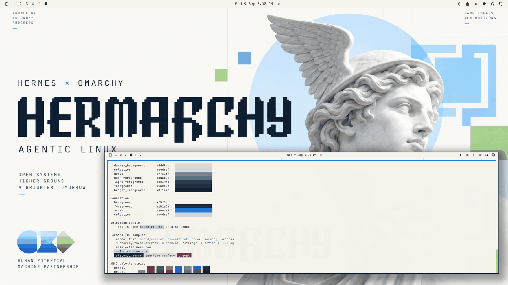

# Hermachy



The collection's first light theme: porcelain background, deep navy-charcoal typography, Omarchy-inspired cobalt accent with cyan support and restrained green — clean, bright, architectural. Built around the Hermachy artwork — the pixel-bitmap HERMARCHY wordmark, winged classical Hermes bust against a pale sky medallion, and the floating modular pixel-grid in cobalt/lime/cyan — official Omarchy-inspired branding language with classical gravitas.

## Light-mode notes

This is a true light theme (`mode = "light"`), following the ramp convention of Omarchy's stock light themes (catppuccin-latte, flexoki-light): the neutral ramp **falls** from `background` (lightest, porcelain) through the surface stops down to the navy foregrounds. Surfaces darken as they recede; text is dark-on-light everywhere. Inactive states (`dark_foreground`, 4.89:1) and muted text (3.55:1) stay readable on porcelain while clearly de-emphasized.

The ANSI set is light-mode calibrated: normal colors are deepened and bright variants are the *darker* saturations (as in stock light themes), so terminal syntax stays legible on the porcelain background.

## Palette

| Role | Hex | Contrast vs background |
| --- | --- | --- |
| background | `#f5f3ec` | — |
| foreground (navy-charcoal) | `#1b2a3a` | 13.14:1 |
| bright_foreground | `#0f1c2b` | 15.49:1 |
| accent (cobalt) | `#2e6fe8` | 4.15:1 |

The accent is the artwork's cobalt, tuned for light-surface readability (4.15:1). The surface ramp runs porcelain → warm-gray stops with a cool blue-tinted `selection`. All named and bright colors hold ≥ 3.87:1 against `background`. Cyan (`#177b8a`) and green (`#3c7a3f`) support the semantic set alongside the cobalt lead.

## What ships

| File | Purpose |
| --- | --- |
| `colors.toml` | Full 26-key light palette — every shell surface, terminal, editor, and app theme generates from this. |
| `backgrounds/0-hermachy.png` | Canonical wallpaper (1672×941), used as-is. |
| `icons.theme` | `Yaru-blue` — the cobalt-matched stock icon set (same choice as Omarchy's stock light themes). |
| `preview.png` | Theme-switcher thumbnail (1800×1012). |

No `.lua`, terminal configs, or `vscode.json` are shipped, so nothing is filtered when the theme is staged from a git checkout — the palette expresses the entire theme.

## Install

From a clone of this repository:

```bash
cp -r themes/hermachy ~/.config/omarchy/themes/
omarchy theme set hermachy
```

## Compatibility

- Built and verified against Omarchy `4.0.3-1` (quattro-era theming: canonical `colors.toml` keys, light-mode ramp per stock light themes, generated surface files).
- No hand-written overrides over generated files; tracks template output cleanly across Omarchy updates.

## Credits and license

- **Wallpaper** (`backgrounds/0-hermachy.png`): created for the Hermachy / Hermes × Omarchy "Agentic Linux" visual identity and supplied by the repository owner (Tony Simons / AIowa LLC) for this collection. Dedicated to the public domain under [CC0 1.0](https://creativecommons.org/publicdomain/zero/1.0/) — copy, modify, and redistribute freely, no attribution required.
- **Preview** (`preview.png`): a derivative work composed from live captures of the applied theme (wallpaper + shell surfaces + palette terminal); same source artwork, same CC0 1.0 dedication.
- **Palette**: hand-authored to the artwork's porcelain/navy/cobalt identity with WCAG contrast verification.
