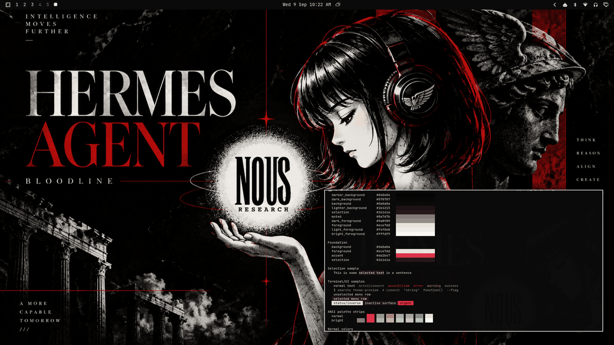

# Hermes Bloodline



A brutalist, premium-editorial dark theme: deep black, bone white, arterial red. Built around the Hermes Bloodline artwork — a grayscale classical Hermes statue against a red-divided editorial layout with the glowing NOUS orb — and tuned as a daily driver, not a screenshot theme.

## Palette

| Role | Hex | Contrast vs background |
| --- | --- | --- |
| background | `#0a0a0a` | — |
| foreground (bone white) | `#ece7dd` | 16.07:1 |
| bright_foreground | `#fffdf9` | 19.49:1 |
| accent (arterial red) | `#da2b47` | 4.16:1 |

All named and bright colors hold ≥ 4:1 against `background` (minimum: `red` at 4.07:1); the neutral ramp runs `#040404 → #1b1215` with a red-tinted `lighter_background` and `selection` so surfaces stay warm-black instead of gray. The terminal ANSI set is desaturated-editorial (dusty green, slate blue, mauve) so red stays the only saturated voice on screen.

## What ships

| File | Purpose |
| --- | --- |
| `colors.toml` | Full 26-key palette — every shell surface, terminal, editor, and app theme generates from this. |
| `backgrounds/0-hermes-bloodline.png` | Canonical wallpaper (1672×941), used as-is. |
| `icons.theme` | `Yaru-red` — the red-accented stock icon set. |
| `preview.png` | Theme-switcher thumbnail. |

No `.lua`, terminal configs, or `vscode.json` are shipped, so nothing is filtered when the theme is staged from a git checkout — the palette expresses the entire theme, exactly as current Omarchy theming intends.

## Install

From a clone of this repository:

```bash
cp -r themes/hermes-bloodline ~/.config/omarchy/themes/
omarchy theme set hermes-bloodline
```

## Compatibility

- Built and verified against Omarchy `4.0.3-1` (quattro-era theming: canonical `colors.toml` keys, generated surface files).
- No hand-written overrides over generated files; tracks template output cleanly across Omarchy updates.

## Credits and license

- **Wallpaper** (`backgrounds/0-hermes-bloodline.png`): created for the Hermes Bloodline visual identity and supplied by the repository owner (Tony Simons / AIowa LLC) for this collection. Dedicated to the public domain under [CC0 1.0](https://creativecommons.org/publicdomain/zero/1.0/) — copy, modify, and redistribute freely, no attribution required.
- **Preview** (`preview.png`): a derivative work composed from live captures of the applied theme (wallpaper + shell surfaces + palette terminal); same source artwork, same CC0 1.0 dedication.
- **Palette**: hand-tuned (with WCAG contrast verification) from the artwork's deep black / bone white / arterial red.
