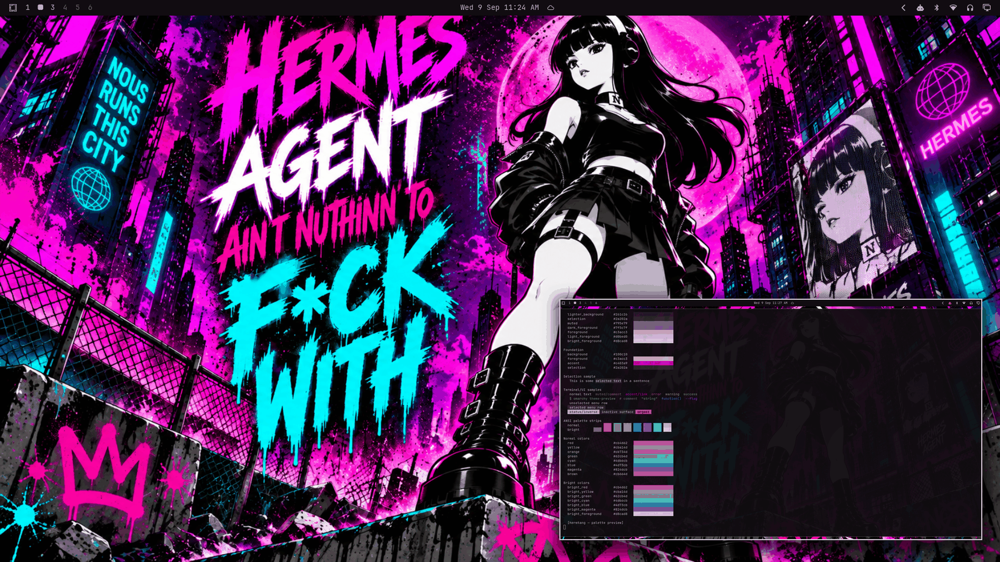

# Hermtang



A cyberpunk street-culture dark theme: black-plum base, lavender foreground, hot-magenta accent. Built around a graffiti-style artwork — a leather-clad figure on a chain-link fence against a neon-drenched cityscape under a giant magenta moon, with dripping "HERMES / AGENT" graffiti and "NOUS RUNS THIS CITY" tags — the loudest theme in the collection.

## Palette

| Role | Hex | Contrast vs background |
| --- | --- | --- |
| background | `#100c10` | — |
| foreground (lavender) | `#c3acc3` | 9.25:1 |
| bright_foreground | `#d8cad8` | 12.35:1 |
| accent (hot magenta) | `#c403a9` | 3.63:1 |

All named and bright colors hold ≥ 3.58:1 against `background`. The neutral ramp runs `#0a070a → #2a202a` in plum tones so every surface stays in the magenta family. The ANSI set is the theme-maker's default editorial set (balanced saturation across all hues) — fitting for a theme that embraces neon variety.

## Repaired relative to the live original

This palette derives from the theme's original daily-driver `colors.toml`, with two minimal fixes to meet this repository's validation floors (original values preserved in git history / PR description):

| Key | Original | Fixed | Why |
| --- | --- | --- | --- |
| `selection` | `#221922` | `#2a202a` | was darker than `lighter_background`, breaking ramp monotonicity |
| `muted` | `#594059` | `#795e79` | was 2.13:1 vs background (near-invisible comments) and out of ramp order |

## What ships

| File | Purpose |
| --- | --- |
| `colors.toml` | 26-key palette. |
| `backgrounds/0-hermtang.png` | Canonical wallpaper (3.2 MB), committed as-is. |
| `icons.theme` | `Yaru-magenta` — the magenta-accented stock icon set. |
| `preview.png` | Theme-switcher thumbnail (1800×1012). |

Color files only — no `.lua`, terminal configs, or `vscode.json` — so nothing is filtered when staged from a git checkout.

## Install

From a clone of this repository:

```bash
cp -r themes/hermtang ~/.config/omarchy/themes/
omarchy theme set hermtang
```

## Compatibility

Built and verified against Omarchy `4.0.3-1` (quattro-era theming). No hand-written overrides over generated files.

## Credits and license

- **Wallpaper** (`backgrounds/0-hermtang.png`): cyberpunk street artwork supplied by the repository owner (Tony Simons / AIowa LLC) for this collection. Dedicated to the public domain under [CC0 1.0](https://creativecommons.org/publicdomain/zero/1.0/) — copy, modify, and redistribute freely, no attribution required.
- **Preview** (`preview.png`): a derivative work composed from live captures of the applied theme (wallpaper + shell surfaces + palette terminal); same source artwork, same CC0 1.0 dedication.
- **Palette**: derived by the Omarchy Theme Maker from the original live theme and tuned for validation compliance (see "Repaired relative to the live original" above).
