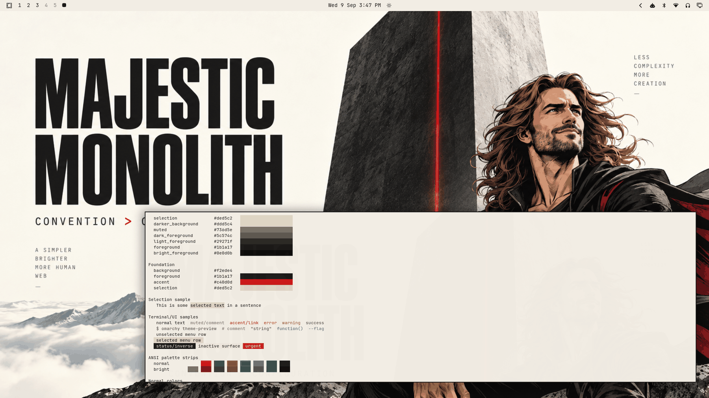

# Majestic Monolith



A brutally simple light theme: warm paper background, dark graphite typography, one ruby-red accent — convention over configuration as a desktop. Built around the Majestic Monolith artwork — the huge condensed MAJESTIC MONOLITH headline over a cream sky, a black obelisk split by a glowing red laser, snow peaks, clouds, and a stylized comic-book hero contemplating the monolith. A nod to DHH's design philosophy: minimal palette, opinionated, premium, clean enough to daily-drive.

## Light-mode notes

A true light theme (`mode = "light"`), following the repo's relationship-based light validation: the warm-paper `background` is the lightest surface, surfaces fall through a subtle gray-cream ramp to `selection`, `muted` sits between surfaces and the graphite foregrounds. Dark text on paper everywhere; inactive states (6.16:1) and muted text (4.42:1) stay clearly readable.

The ANSI set is light-mode calibrated: normal colors deepened, bright variants darker still — terminal syntax stays legible on paper. The red accent appears only where accents belong (active borders, urgent, links) — the monolith's laser, not a coat of paint.

## Palette

| Role | Hex | Contrast vs background |
| --- | --- | --- |
| background | `#f2ede4` | — |
| foreground (graphite) | `#1b1a17` | 14.92:1 |
| bright_foreground | `#0e0d0b` | 16.66:1 |
| accent (ruby) | `#c40d0d` | 5.28:1 |

The accent is classic Rails red, sitting at a comfortable 5.28:1 on cream. The surface ramp runs paper → warm gray-cream stops. All named and bright colors hold ≥ 4.33:1 against `background`.

Semantic colors are restrained earth-deepened tones (brick red errors, ochre warnings, forest success, slate supports) — visible without introducing a second loud voice.

## What ships

| File | Purpose |
| --- | --- |
| `colors.toml` | Full 26-key light palette — every shell surface, terminal, editor, and app theme generates from this. |
| `backgrounds/0-majestic-monolith.png` | Canonical wallpaper (1672×941), used as-is. |
| `icons.theme` | `Yaru-red` — the ruby-matched stock icon set. |
| `preview.png` | Theme-switcher thumbnail (1800×1012). |

No `.lua`, terminal configs, or `vscode.json` are shipped, so nothing is filtered when the theme is staged from a git checkout — the palette expresses the entire theme.

## Install

From a clone of this repository:

```bash
cp -r themes/majestic-monolith ~/.config/omarchy/themes/
omarchy theme set majestic-monolith
```

## Compatibility

- Built and verified against Omarchy `4.0.3-1` (quattro-era theming: canonical `colors.toml` keys, light-mode surface relationships, generated surface files).
- No hand-written overrides over generated files; tracks template output cleanly across Omarchy updates.

## Credits and license

- **Wallpaper** (`backgrounds/0-majestic-monolith.png`): created for the Majestic Monolith visual identity and supplied by the repository owner (Tony Simons / AIowa LLC) for this collection. The figure is a stylized comic-book/graphic-novel character, not a real-person likeness. Dedicated to the public domain under [CC0 1.0](https://creativecommons.org/publicdomain/zero/1.0/) — copy, modify, and redistribute freely, no attribution required.
- **Preview** (`preview.png`): a derivative work composed from live captures of the applied theme (wallpaper + shell surfaces + palette terminal); same source artwork, same CC0 1.0 dedication.
- **Palette**: hand-authored to the artwork's paper/graphite/ruby identity with WCAG contrast verification.
