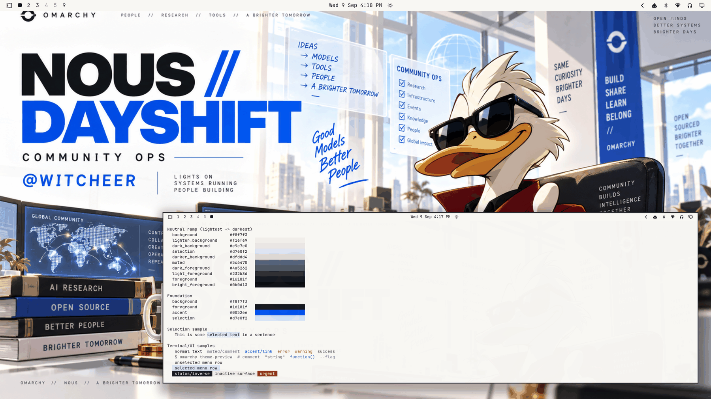

# Nous DayShift



A bright, community-operations light theme for Omarchy — the human-facing daylight shift of Nous Research: systems running, models moving, people building. A warm-white research-lab foundation carries strong cobalt-blue typography, graphite ink, restrained cyan support, a confident red personality accent, and small gold/token highlights. Premium editorial layout, high-key daylight.

**A tribute to @Witcheer.** DayShift is dedicated to Witcheer, Nous Research community lead, in appreciation of the community-facing side of Nous and Hermes — the "lights on, systems running, people building" energy of open community operations. The wallpaper's duck-in-shades mascot is an original illustrated character created for this collection: it draws on the swagger and visual energy of Witcheer's supplied profile-picture vibe (shades, red coat, gold pin, confident point) while being a stylized mascot of our own, not a copy of any profile image. This theme is an unofficial fan tribute and is not endorsed by, commissioned by, or affiliated with Witcheer or Nous Research.

Built around the **NOUS // DAYSHIFT** artwork: the massive NOUS wordmark with the blue `//` mark, DAYSHIFT in cobalt, `@WITCHEER` and `COMMUNITY OPS` lockup, the IDEAS / COMMUNITY OPS cards, the GLOBAL COMMUNITY and MODEL WORKFLOW monitors (IDEAS → DATA → TRAIN → EVAL → DEPLOY → PEOPLE), the gold-token desk, and the mascot in the executive chair at the window wall.

## Light-mode notes

A true light theme (`mode = "light"`) following the ramp convention of Omarchy's stock light themes (catppuccin-latte, flexoki-light) and this collection's first light theme, Hermachy: the neutral ramp **falls** from `background` (lightest — the artwork's warm-white sky/wall foundation) through the surface stops down to the graphite foregrounds. Surfaces darken as they recede; text is dark-on-light everywhere.

The ANSI set is light-mode calibrated: normal colors are deepened for legibility on the warm-white background and bright variants are the *darker* saturations (matching stock light-theme convention), so terminal syntax stays readable on a daylight surface.

The accent is the artwork's own type cobalt — the exact family of the giant DAYSHIFT lettering — kept at full strength rather than deepened, because it already clears the daily-driver bar (5.69:1). The coat red is deepened slightly from the artwork's most saturated pixels to serve as a readable semantic/personality accent without overpowering the blue identity. Gold stays a small supporting signal (token/coin highlights), deepened for contrast, never primary.

## Palette

| Role | Hex | Contrast vs background |
| --- | --- | --- |
| background (warm white) | `#f8f7f3` | — |
| foreground (graphite ink) | `#16181f` | 16.54:1 |
| bright_foreground | `#0b0d13` | 18.12:1 |
| accent (Nous type cobalt) | `#0052ee` | 5.69:1 |
| muted | `#5c6470` | 5.58:1 |
| selection (blue-tinted) | `#d7e0f2` | — |

All named and bright colors hold ≥ 4.13:1 against `background`: red `#b32424` 6.13:1, yellow (gold) `#9a7113` 4.13:1, orange `#b8531c` 4.56:1, green `#2e7d43` 4.74:1, cyan `#0e6f8e` 5.32:1, blue `#2c56b0` 6.39:1, magenta `#8d3fa8` 5.75:1, brown `#7d5a3a` 5.77:1. Bright variants run 5.94:1–9.04:1. The surface ramp: `#f8f7f3` → `#f1efe9` → `#e9e7e0` → `#dfddd4`, with the blue-tinted selection `#d7e0f2` between them.

## What ships

| File | Purpose |
| --- | --- |
| `colors.toml` | Full 26-key light palette — every shell surface, terminal, editor, and app theme generates from this. |
| `backgrounds/0-nous-dayshift.png` | Canonical wallpaper (1672×941), supplied by the repository owner as the theme's original artwork; used as-is. |
| `icons.theme` | `Yaru-blue` — the cobalt-matched stock icon set (same choice as Omarchy's stock light themes). |
| `preview.png` | Theme-switcher thumbnail (1800×1012), captured from a live themed session. |

No `.lua`, terminal configs, or `vscode.json` are shipped, so nothing is filtered when the theme is staged from a git checkout — the palette expresses the entire theme.

## Compatibility

- Built and verified against Omarchy `4.0.3-1` (quattro-era theming: canonical `colors.toml` keys, light-mode surface relationships per the corrected validator, generated surface files).
- No hand-written overrides over generated files; tracks template output cleanly across Omarchy updates.

## Credits & license

Wallpaper and preview derivative created for this collection and supplied by the repository owner as canonical theme artwork — original illustrated mascot inspired by the visual energy of @Witcheer's profile picture, not a copy of it. Dedicated to @Witcheer and the Nous Research community; unofficial fan tribute, no endorsement or commission implied. Distributed under the repository's default CC0 dedication by the supplier; no third-party logos or unlicensed assets included.

## Install

From a clone of this repository:

```bash
cp -r themes/nous-dayshift ~/.config/omarchy/themes/
omarchy theme set nous-dayshift
```
