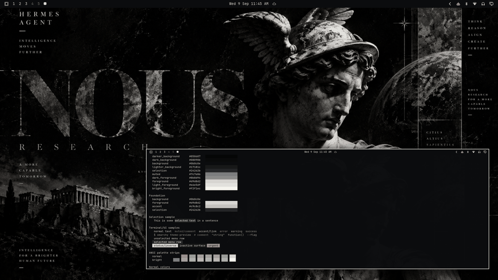

# Nous Noir



A museum-noir monochrome dark theme: ink black, charcoal, graphite, silver, bone white — strictly grayscale, no chromatic accent. Built around the Nous Research editorial artwork — a chiaroscuro-lit classical Hermes statue beside the oversized NOUS wordmark, grain and celestial chart overlays — for a premium editorial, gallery-quiet desktop. The restrained sibling of Hermes Bloodline.

## Palette

| Role | Hex | Contrast vs background |
| --- | --- | --- |
| background | `#0b0c0e` | — |
| foreground (bone white) | `#d9d8d2` | 13.70:1 |
| bright_foreground | `#f2f1ec` | 17.30:1 |
| accent (silver) | `#c9c8c2` | 11.67:1 |

The accent is bone-silver rather than a hue — emphasis comes from lightness, not color. The neutral ramp runs `#050607 → #24262b` in cool "ink-on-stone" grays matching the artwork's cast. All named and bright colors hold ≥ 6.06:1 against `background`.

Semantic colors are deliberately desaturated, grayscale-compatible tones: `red` is a muted rose-gray (`#b0868a`), `green` a sage-stone (`#96a392`), `yellow` a bone-olive (`#b3a98e`). Errors, warnings, and success stay legible without breaking the monochrome mood.

## What ships

| File | Purpose |
| --- | --- |
| `colors.toml` | Full 26-key palette — every shell surface, terminal, editor, and app theme generates from this. |
| `backgrounds/0-nous-noir.png` | Canonical wallpaper (1672×941), used as-is. |
| `icons.theme` | `Yaru-gray` — the neutral stock icon set. |
| `preview.png` | Theme-switcher thumbnail (1800×1012). |

No `.lua`, terminal configs, or `vscode.json` are shipped, so nothing is filtered when the theme is staged from a git checkout — the palette expresses the entire theme.

## Install

From a clone of this repository:

```bash
cp -r themes/nous-noir ~/.config/omarchy/themes/
omarchy theme set nous-noir
```

## Compatibility

- Built and verified against Omarchy `4.0.3-1` (quattro-era theming: canonical `colors.toml` keys, generated surface files).
- No hand-written overrides over generated files; tracks template output cleanly across Omarchy updates.

## Credits and license

- **Wallpaper** (`backgrounds/0-nous-noir.png`): created for the Nous Research / Hermes Agent visual identity and supplied by the repository owner (Tony Simons / AIowa LLC) for this collection. Dedicated to the public domain under [CC0 1.0](https://creativecommons.org/publicdomain/zero/1.0/) — copy, modify, and redistribute freely, no attribution required.
- **Preview** (`preview.png`): a derivative work composed from live captures of the applied theme (wallpaper + shell surfaces + palette terminal); same source artwork, same CC0 1.0 dedication.
- **Palette**: hand-authored to the artwork's grayscale cast with WCAG contrast verification.
