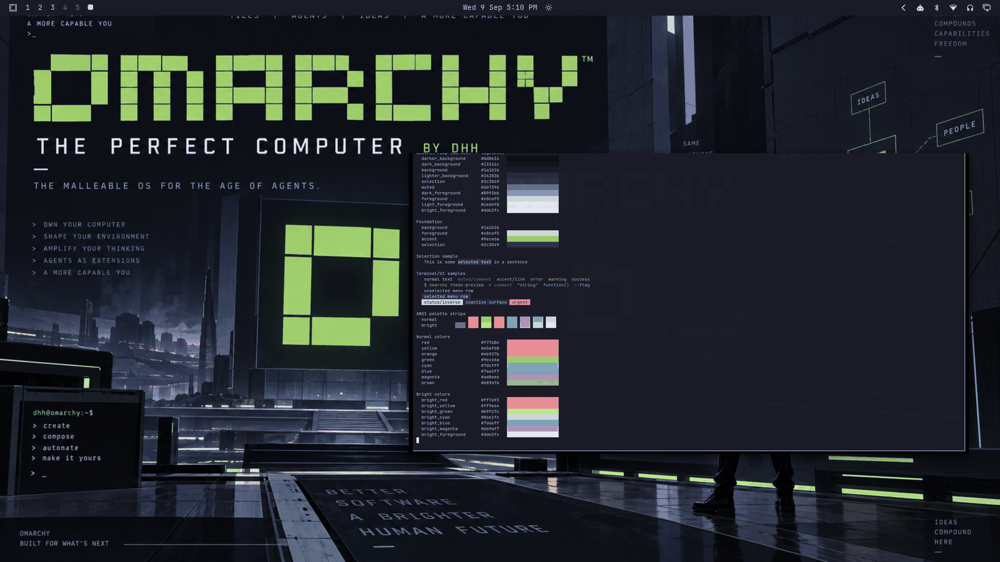

# The Perfect Computer



An unofficial community tribute to [Omarchy](https://omarchy.org) — and a nod to its creator, DHH. The visual concept centers on Omarchy as **The Perfect Computer**: the malleable OS for the age of agents, a machine you own, shape, and extend — agents as amplifiers of your own thinking, ideas compounding into systems. Omarchy's identity leads here; DHH is the secondary attribution, exactly as the artwork frames it (`THE PERFECT COMPUTER — BY DHH`).

The theme is built from the supplied hero artwork: deep Tokyo-Night-family navy-black, the official Omarchy green (`#9ece6a`) as the single signature accent, pale blue-white text, graphite/navy surfaces, crisp pixel-grid geometry, and a terminal-native, zero-radius, hard-edged visual language. It should feel like Omarchy itself became a desktop theme.

> **Not affiliated or endorsed.** This is a community-made theme. Omarchy is a project by David Heinemeier Hansson. Nothing here claims Omarchy's endorsement.

## Dark-mode notes

A true dark theme (`mode = "dark"`). The neutral ramp rises strictly from `#0d0e14` (deepest surface) through the `#1a1b26` base to `#24283b` panels and `#2c3049` selection, with foregrounds in the pale blue-white family. Green is the signature, not just another ANSI color: `accent`, `green`, and `active_border_color` are all the official Omarchy green; cyan and violet remain in disciplined support roles for terminal syntax.

## Palette

| Role | Hex | Contrast vs background |
| --- | --- | --- |
| background | `#1a1b26` | — |
| darker_background | `#0d0e14` | — |
| dark_background | `#13141c` | — |
| lighter_background | `#24283b` | — |
| selection | `#2c3049` | — |
| muted | `#6b7396` | 3.68:1 |
| dark_foreground | `#8993bb` | 5.66:1 |
| foreground (pale blue-white) | `#c0caf5` | 10.59:1 |
| light_foreground | `#ced6f8` | 11.88:1 |
| bright_foreground | `#dde2fc` | 13.31:1 |
| accent (Omarchy green) | `#9ece6a` | 9.35:1 |

| Role | Hex | Contrast vs background |
| --- | --- | --- |
| red | `#f7768e` | 6.46:1 |
| yellow | `#e0af68` | 8.55:1 |
| orange | `#eb927b` | 7.27:1 |
| green (Omarchy green) | `#9ece6a` | 9.35:1 |
| cyan | `#7dcfff` | 9.96:1 |
| blue | `#7aa2f7` | 6.79:1 |
| magenta | `#ad8ee6` | 6.34:1 |
| brown | `#b89a7a` | 6.46:1 |

| Role | Hex | Contrast vs background |
| --- | --- | --- |
| bright_red | `#ff7a93` | 6.88:1 |
| bright_yellow | `#ff9e64` | 8.40:1 |
| bright_green | `#b9f27c` | 13.07:1 |
| bright_cyan | `#86e1fc` | 11.55:1 |
| bright_blue | `#7da6ff` | 7.14:1 |
| bright_magenta | `#bb9af7` | 7.39:1 |

Every normal and bright ANSI color holds ≥ 6.34:1 against `background`; muted text 3.68:1, inactive `dark_foreground` 5.66:1, and selected text (`bright_foreground` vs `selection`) 10.06:1 — comfortably above the validator floors and the collection's daily-driver targets (foreground ≥ 10:1, accent ≥ 4:1).

## What ships

| File | Purpose |
| --- | --- |
| `colors.toml` | Full 26-key palette plus current-Omarchy border extensions — every shell surface, terminal, editor, and app theme generates from this. |
| `backgrounds/0-perfect-computer.png` | Canonical wallpaper (1672×941), used as-is. |
| `icons.theme` | `Yaru-sage` — the green-family stock icon set shipped by Omarchy (same choice as the stock `everforest`, `osaka-jade`, and `solitude` themes). |
| `preview.png` | Theme-switcher thumbnail (1800×1012). |

No `.lua`, terminal configs, or `vscode.json` are shipped, so nothing is filtered when the theme is staged from a git checkout — the palette expresses the entire theme.

## Install

From a clone of this repository:

```bash
cp -r themes/perfect-computer ~/.config/omarchy/themes/
omarchy theme set perfect-computer
```

## Compatibility

- Built and verified against Omarchy `4.0.3-1` (quattro-era theming: canonical `colors.toml` keys, generated surface files).
- No hand-written overrides over generated files; tracks template output cleanly across Omarchy updates.

## Credits, trademark, and license

- **Wallpaper** (`backgrounds/0-perfect-computer.png`): original composition created for this collection and supplied by the repository owner (Tony Simons / AIowa LLC). The composition itself is dedicated to the public domain under [CC0 1.0](https://creativecommons.org/publicdomain/zero/1.0/) by its supplier — **but the Omarchy name, wordmark, pixel-tile logo, and other official Omarchy marks contained within it are not CC0**: they remain subject to the copyright and trademark rights of their respective owners (the Omarchy project / David Heinemeier Hansson) and are included here for an unofficial community tribute only. No ownership of, or endorsement by, Omarchy is claimed.
- **Omarchy code** is released under the MIT License; the official marks are separate from code licensing and are not dedicated to the public domain by the Omarchy project.
- **Preview** (`preview.png`): a derivative work composed from live captures of the applied theme (wallpaper + shell surfaces + palette terminal). It embeds the same Omarchy marks and therefore carries the same caveat: the composition is CC0 by its supplier, while the official Omarchy marks within it remain with their owners.
- **Palette**: hand-authored to the artwork's navy/green/pale-blue-white identity with WCAG contrast verification.
