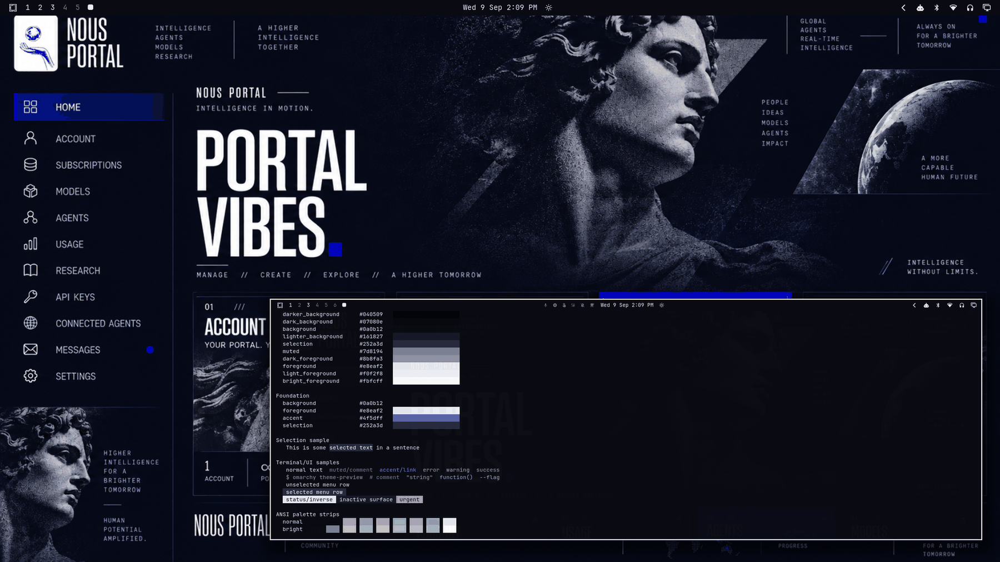

# Portal Vibes



A premium technical dark theme: deep navy-black base, electric cobalt accent, crisp white typography, cool graphite secondaries — the Nous Portal dashboard aesthetic as a daily-driver desktop. Built around the Portal Vibes artwork — a modular dashboard composition with classical statuary, cosmic imagery, and the "PORTAL VIBES" display type over near-black panels — sleek, monochrome-classical, with one live signal color.

## Palette

| Role | Hex | Contrast vs background |
| --- | --- | --- |
| background | `#0a0b12` | — |
| foreground (crisp white) | `#e8eaf2` | 16.35:1 |
| bright_foreground | `#fbfcff` | 19.14:1 |
| accent (electric cobalt) | `#4f5dff` | 4.06:1 |

The accent is the dashboard's electric cobalt, lifted just enough from the artwork's deepest ultramarine to hold ≥ 4:1 against the navy-black base. The neutral ramp runs `#040509 → #252a3d` in cool blue-violet grays matching the artwork's panel tones. All named and bright colors hold ≥ 6.44:1 against `background`.

Semantic colors are desaturated, portal-UI compatible tones (dusty rose red, parchment yellow, sage green, slate blue) — readable errors/warnings/success without breaking the technical-navy mood.

## What ships

| File | Purpose |
| --- | --- |
| `colors.toml` | Full 26-key palette — every shell surface, terminal, editor, and app theme generates from this. |
| `backgrounds/0-portal-vibes.png` | Canonical wallpaper (1672×941), used as-is. |
| `icons.theme` | `Yaru-blue` — the cobalt-matched stock icon set. |
| `preview.png` | Theme-switcher thumbnail (1800×1012). |

No `.lua`, terminal configs, or `vscode.json` are shipped, so nothing is filtered when the theme is staged from a git checkout — the palette expresses the entire theme.

## Install

From a clone of this repository:

```bash
cp -r themes/portal-vibes ~/.config/omarchy/themes/
omarchy theme set portal-vibes
```

## Compatibility

- Built and verified against Omarchy `4.0.3-1` (quattro-era theming: canonical `colors.toml` keys, generated surface files).
- No hand-written overrides over generated files; tracks template output cleanly across Omarchy updates.

## Credits and license

- **Wallpaper** (`backgrounds/0-portal-vibes.png`): created for the Nous Portal / Hermes Agent visual identity and supplied by the repository owner (Tony Simons / AIowa LLC) for this collection. Dedicated to the public domain under [CC0 1.0](https://creativecommons.org/publicdomain/zero/1.0/) — copy, modify, and redistribute freely, no attribution required.
- **Preview** (`preview.png`): a derivative work composed from live captures of the applied theme (wallpaper + shell surfaces + palette terminal); same source artwork, same CC0 1.0 dedication.
- **Palette**: hand-authored to the artwork's navy/cobalt/white identity with WCAG contrast verification.
