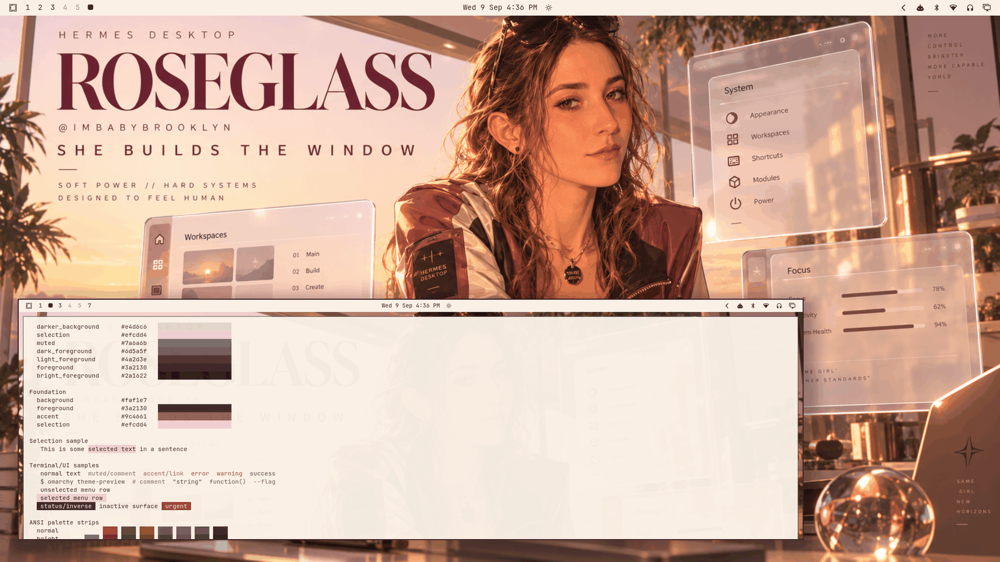

# Roseglass



A soft-power light theme: pearl and cream foundation, deep wine-plum ink, rose-glass accents — *she builds the window*. Built around the ROSEGLASS artwork: the oversized serif wordmark in deep wine, floating frosted-glass System/Workspaces/Focus panes drifting around a confident heroine in a satin blush bomber, a sunset cityscape and desk of books, mug, and crystal orb. Feminine but badass; premium editorial with chrome-glass UI language. Soft power, hard systems.

**A tribute to @imbabybrooklyn.** Roseglass is a Hermes Desktop tribute theme and a nod to Brooklyn, Hermes Desktop lead — the heroine and art direction draw on her vibe and desktop-lead energy, and the theme celebrates the polished, human-centered side of Hermes Desktop ("designed to feel human"). This is an unofficial appreciation; no endorsement, commission, or affiliation is claimed.

## Light-mode notes

A true light theme (`mode = "light"`) under the collection's relationship-based light validation: the pearl `background` is the lightest surface, surfaces fall through warm cream/greige stops to the rose-tinted `selection`, `muted` sits between surfaces and the wine foregrounds. Dark-wine text on pearl everywhere; inactive states (5.74:1) and muted text (4.58:1) stay comfortably readable.

The ANSI set is light-mode calibrated: normal colors deepened, bright variants darker still — terminal syntax stays legible on pearl. The accent is the artwork's rose-mauve glass, deepened from the satin's brightest tones to a wine-rose that carries active states at 5.43:1 without turning the theme generic pink.

## Palette

| Role | Hex | Contrast vs background |
| --- | --- | --- |
| background (pearl) | `#faf1e7` | — |
| foreground (deep wine) | `#3a2130` | 13.05:1 |
| bright_foreground | `#2a1622` | 15.21:1 |
| accent (rose glass) | `#9c4661` | 5.43:1 |
| muted (warm greige) | `#7a6a6b` | 4.58:1 |
| selection (rose tint) | `#efcdd4` | — |

All named and bright colors hold ≥ 4.89:1 against `background`: red `#9c2f3c` 6.52:1, yellow (amber) `#8a621a` 4.89:1, orange `#a1511f` 5.06:1, green `#4a6e33` 5.27:1, cyan `#1f6a6e` 5.62:1, blue `#3a5580` 6.74:1, magenta `#7c3d78` 6.72:1, brown (cocoa) `#6e4a2c` 7.02:1. The surface ramp: `#faf1e7` → `#f6ecdf` → `#f0e5d8` → `#e4d6c6`, with the rose-tinted selection between them.

## What ships

| File | Purpose |
| --- | --- |
| `colors.toml` | Full 26-key light palette — every shell surface, terminal, editor, and app theme generates from this. |
| `backgrounds/0-roseglass.png` | Canonical artwork (1672×941), owner-supplied, used as-is. |
| `icons.theme` | `Yaru-purple` — the mauve-matched supported stock icon set. |
| `preview.png` | Theme-switcher thumbnail (1800×1012), captured from a live themed session. |

No `.lua`, terminal configs, or `vscode.json` are shipped, so nothing is filtered when the theme is staged from a git checkout — the palette expresses the entire theme.

## Install

From a clone of this repository:

```bash
cp -r themes/roseglass ~/.config/omarchy/themes/
omarchy theme set roseglass
```

## Compatibility

- Built and verified against Omarchy `4.0.3-1` (quattro-era theming: canonical `colors.toml` keys, light-mode surface relationships, generated surface files).
- No hand-written overrides over generated files; tracks template output cleanly across Omarchy updates.

## Credits & license

- **Wallpaper** (`backgrounds/0-roseglass.png`): created for this collection and supplied by the repository owner (Tony Simons / AIowa LLC) as canonical theme artwork — an original editorial composition whose heroine and art direction are inspired by @imbabybrooklyn's vibe and desktop-lead energy, not a likeness copy. Dedicated to the public domain under [CC0 1.0](https://creativecommons.org/publicdomain/zero/1.0/) — copy, modify, and redistribute freely, no attribution required. Unofficial tribute; no endorsement or commission implied. No third-party logos or unlicensed assets.
- **Preview** (`preview.png`): a derivative work composed from live captures of the applied theme (wallpaper + shell surfaces + palette terminal); same source artwork, same CC0 1.0 dedication.
- **Palette**: hand-authored to the artwork's pearl/wine/rose-glass identity with WCAG contrast verification.
