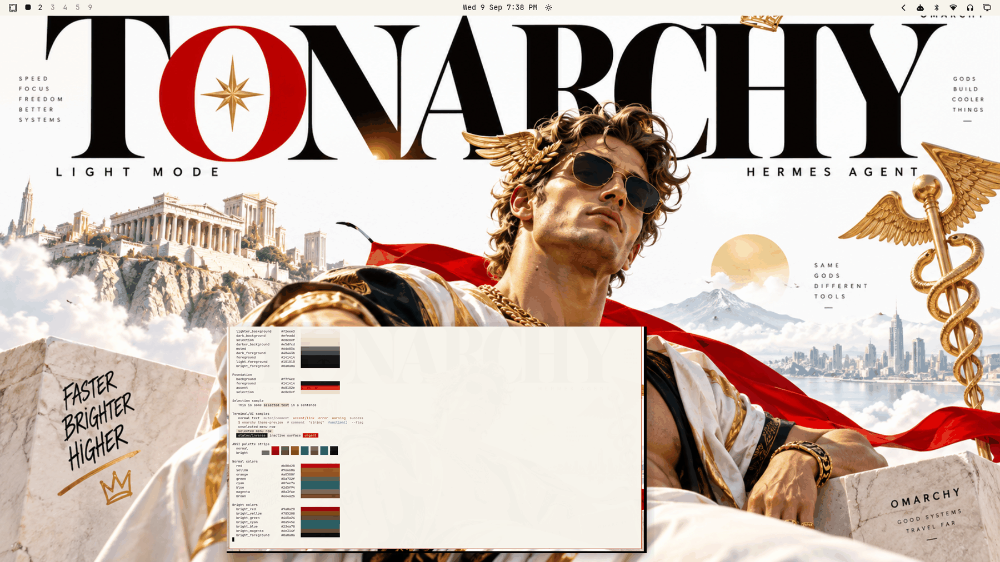

# Tonarchy



A luxury tech-fashion campaign for Omarchy: **Hermes the Greek god, blinged out** — marble Olympus, giant editorial serif, a crimson "O" with a gold compass star, winged caduceus, Cuban-link gold. Built from the supplied TONARCHY artwork: white marble base, near-black ink typography, hard signal red, metallic gold support. **Light mode.** Faster / brighter / higher — gods build cooler things; same gods, different tools.

The theme translates the campaign into a loud-but-precise light daily-driver: marble-white `#f7f4ec` base with warm stone surfaces, near-black deep-ink text, an aggressive signal-red accent kept at raw artwork strength, operational gold for the yellow role, and restrained royal blue / teal / olive purely in service of terminal syntax. The visual hierarchy is **WHITE → BLACK → RED → GOLD** — everything else stays secondary. No pink anywhere.

> **Not affiliated or endorsed.** An original Tonarchy theme with a Hermes-the-Greek-god visual concept. Any Omarchy marks appearing in the artwork belong to their respective owners; nothing here claims Omarchy's endorsement or affiliation.

## Light-mode notes

A true light theme (`mode = "light"`), validated by the repo's relationship-based light-theme model: `background` is the lightest surface stop, `muted` sits between the surfaces and the primary foregrounds, and `foreground`/`bright_foreground` are darker than every surface. Normal ANSI colors are deepened saturations and bright variants are the darker tones — terminal syntax stays loud and legible on marble.

**Accessibility-driven gold deviation:** the artwork's metallic gold (`~#c9a961`) measures **2.05:1** on marble white — far below any usable floor. The operational gold is a much darker antiqued gold from the same hue family, `#96660a` (**4.55:1**), so gold reads as *gold* in the shell without washing out. The signal red needed no such compromise: the raw artwork red `#c8102e` already delivers **5.35:1** and ships as the accent unchanged.

## Palette

| Role | Hex | Contrast vs background |
| --- | --- | --- |
| background (marble white) | `#f7f4ec` | — |
| lighter_background | `#f2eee3` | — |
| dark_background | `#efeadd` | — |
| darker_background (warm stone) | `#e5dfcd` | — |
| selection (marble tint) | `#e8e0cf` | — |
| muted (warm gray) | `#6d685c` | 5.05:1 |
| dark_foreground (inactive) | `#48443b` | 8.82:1 |
| foreground (deep ink) | `#141414` | 16.76:1 |
| light_foreground | `#101010` | 17.31:1 |
| bright_foreground | `#0a0a0a` | 18.01:1 |
| accent (signal red) | `#c8102e` | 5.35:1 |

| Role | Hex | Contrast vs background |
| --- | --- | --- |
| red | `#b80d28` | 6.11:1 |
| yellow (operational gold) | `#96660a` | 4.55:1 |
| orange (gold-orange) | `#a0500f` | 5.24:1 |
| green (olive) | `#5a732f` | 4.86:1 |
| cyan (teal) | `#0f6e7a` | 5.41:1 |
| blue (royal blue) | `#2d5f94` | 6.02:1 |
| magenta (deep plum) | `#8a3f6e` | 6.33:1 |
| brown | `#6e4a26` | 7.15:1 |

| Role | Hex | Contrast vs background |
| --- | --- | --- |
| bright_red | `#9a0a20` | 7.84:1 |
| bright_yellow (antiqued gold) | `#785208` | 6.35:1 |
| bright_green | `#465a24` | 6.95:1 |
| bright_cyan | `#0a545e` | 7.82:1 |
| bright_blue | `#234a78` | 8.23:1 |
| bright_magenta | `#6e314f` | 8.62:1 |

Every ratio above was computed per color with standard WCAG relative luminance — no rounded-minimum claims. Every normal and bright ANSI color holds **≥ 4.55:1** against `background` and **≥ 3.81:1** against the darkest surface (`selection`, `#e8e0cf`); the minima are yellow `#96660a` in both cases, checked color-by-color. Selected text (`bright_foreground` vs `selection`) is 15.08:1.

## What ships

| File | Purpose |
| --- | --- |
| `colors.toml` | Full 26-key light palette — every shell surface, terminal, editor, and app theme generates from this. |
| `backgrounds/0-tonarchy.png` | Canonical wallpaper (1672×941), used as-is. |
| `icons.theme` | `Yaru-red` — the red-family stock icon set shipped by Omarchy (same choice as stock `matte-black` / this collection's `hermes-bloodline`). |
| `preview.png` | Theme-switcher thumbnail (1800×1012). |

No `.lua`, terminal configs, or `vscode.json` are shipped, so nothing is filtered when the theme is staged from a git checkout — the palette expresses the entire theme.

## Install

From a clone of this repository:

```bash
cp -r themes/tonarchy ~/.config/omarchy/themes/
omarchy theme set tonarchy
```

## Compatibility

- Built and verified against Omarchy `4.0.3-1` (quattro-era theming: canonical `colors.toml` keys, light-mode surface relationships per stock light themes).
- No hand-written overrides over generated files; tracks template output cleanly across Omarchy updates.

## Credits, trademark, and license

- **Wallpaper** (`backgrounds/0-tonarchy.png`): original composition created for this collection and supplied by the repository owner (Tony Simons / AIowa LLC). The composition itself is dedicated to the public domain under [CC0 1.0](https://creativecommons.org/publicdomain/zero/1.0/) by its supplier — **but the Omarchy name and any other third-party names, logos, or marks contained within it are not CC0**: they remain subject to the copyright and trademark rights of their respective owners and are used here for an unofficial community tribute only. No ownership of, or endorsement by, those mark owners is claimed.
- **Preview** (`preview.png`): a derivative work composed from live captures of the applied theme (wallpaper + shell surfaces + palette terminal). It embeds the same marks and therefore carries the same caveat: the composition is CC0 by its supplier, while the third-party marks within it remain with their owners.
- **Palette**: hand-authored to the artwork's marble/ink/red/gold identity with WCAG contrast verification.
