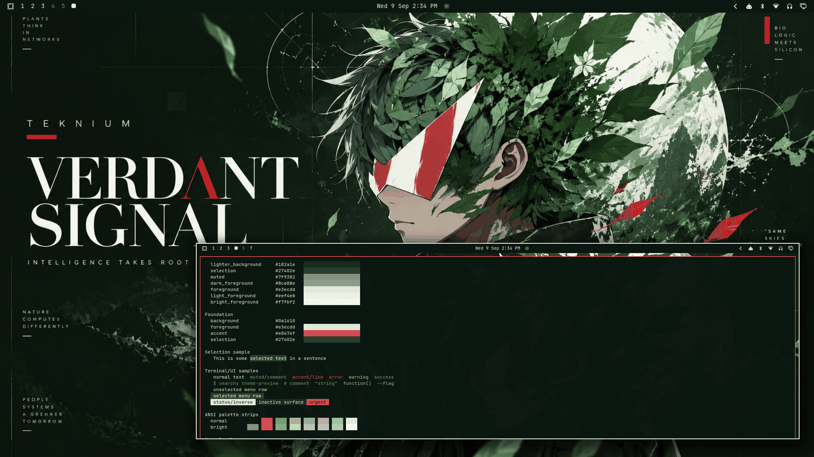

# Verdant Signal



A bio-compute editorial dark theme: near-black forest green base, emerald and sage surfaces, pale-mint/white foregrounds, and one restrained crimson signal accent. Built around the Verdant Signal artwork — a Teknium-inspired side-profile character whose hair dissolves into foliage, white visor with the red triangular mark, moon and HUD geometry overlays — nature + machine intelligence, premium editorial styling, practical as a daily driver.

## Palette

| Role | Hex | Contrast vs background |
| --- | --- | --- |
| background | `#0a1610` | — |
| foreground (pale mint) | `#e3ecdd` | 15.25:1 |
| bright_foreground | `#f7fbf2` | 17.65:1 |
| accent (signal red) | `#e0474f` | 4.57:1 |

The accent is the artwork's visor crimson, tuned to stay a *signal* — visible on active borders, urgent states, and links — while the green family leads every surface. The neutral ramp runs `#040a06 → #27402e` in forest/emerald tones so panels, bars, and popups stay botanical. All named and bright colors hold ≥ 4.21:1 against `background`.

Semantic colors keep clear distinction inside the green-led identity: `red` is the signal crimson family (errors/urgent share the visor's voice), `green` a true emerald (success), `yellow` a leaf-parchment (warnings), with sage cyan and mossy supporting tones.

## What ships

| File | Purpose |
| --- | --- |
| `colors.toml` | Full 26-key palette — every shell surface, terminal, editor, and app theme generates from this. |
| `backgrounds/0-verdant-signal.png` | Canonical wallpaper (1672×941), used as-is. |
| `icons.theme` | `Yaru-sage` — the sage-green stock icon set. |
| `preview.png` | Theme-switcher thumbnail (1800×1012). |

No `.lua`, terminal configs, or `vscode.json` are shipped, so nothing is filtered when the theme is staged from a git checkout — the palette expresses the entire theme.

## Install

From a clone of this repository:

```bash
cp -r themes/verdant-signal ~/.config/omarchy/themes/
omarchy theme set verdant-signal
```

## Compatibility

- Built and verified against Omarchy `4.0.3-1` (quattro-era theming: canonical `colors.toml` keys, generated surface files).
- No hand-written overrides over generated files; tracks template output cleanly across Omarchy updates.

## Credits and license

- **Wallpaper** (`backgrounds/0-verdant-signal.png`): created for the Verdant Signal / Teknium-inspired visual identity and supplied by the repository owner (Tony Simons / AIowa LLC) for this collection. Dedicated to the public domain under [CC0 1.0](https://creativecommons.org/publicdomain/zero/1.0/) — copy, modify, and redistribute freely, no attribution required.
- **Preview** (`preview.png`): a derivative work composed from live captures of the applied theme (wallpaper + shell surfaces + palette terminal); same source artwork, same CC0 1.0 dedication.
- **Palette**: hand-authored to the artwork's forest/emerald/signal-red identity with WCAG contrast verification.
